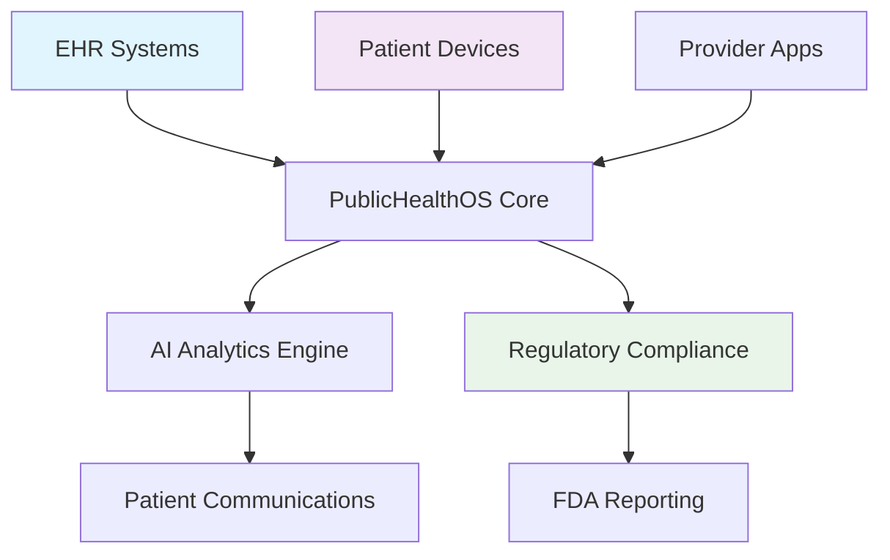

# Healthcare System Integration Strategy
## NIW Evidence: Enterprise Systems Analysis

## Systems Architecture Overview

```mermaid
graph TB
    A[EHR Systems] --> B[PublicHealthOS Core]
    C[Patient Devices] --> B
    D[Provider Apps] --> B
    B --> E[AI Analytics Engine]
    B --> F[Regulatory Compliance]
    E --> G[Patient Communications]
    F --> H[FDA Reporting]
    
    style A fill:#e1f5fe
    style C fill:#f3e5f5
    style F fill:#e8f5e8
```
