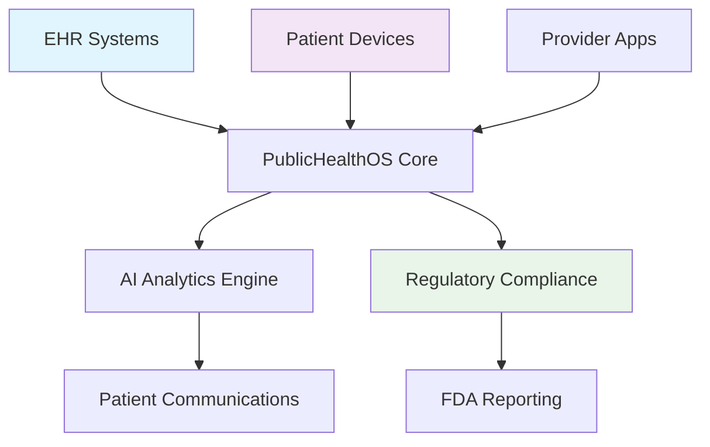

# Healthcare System Integration Strategy
## NIW Evidence: Enterprise Systems Analysis

## Systems Architecture Overview

# Integration Requirements Analysis

## EHR Systems Integration

### Target Systems
- Epic
- Cerner  
- Allscripts

### Integration Standards
- HL7 FHIR R4

### Data Elements
- Patient demographics
- Lab results (A1C, lipids)
- Medication lists
- Visit history

### Technical Requirements
- API-based real-time integration
- HIPAA-compliant data encryption
- Audit logging for compliance
- Fallback mechanisms for downtime

## Payment Systems Integration

### Payer Types
- Medicare
- Medicaid
- Commercial

### Integration Points
- Claims processing systems
- Prior authorization workflows
- Reimbursement calculation engines
- Quality reporting interfaces

### Business Requirements
- Value-based care contract support
- Real-time eligibility verification
- Automated claims submission
- Performance metric reporting

## Regulatory Systems Integration

### FDA Requirements
- eSTAR electronic submission format
- Post-market surveillance reporting
- Quality management system integration
- Adverse event reporting protocols

### State Compliance
- California Medical Board requirements
- State telehealth regulations
- Data privacy laws (CCPA)

## Interface Specifications

### API Design Principles
- RESTful architecture with JSON payloads
- OAuth 2.0 authentication
- Rate limiting and throttling
- Comprehensive error handling

### Data Mapping Documentation
**Source Systems → PublicHealthOS:**
- Patient ID → Hashed identifier
- Lab results → Standardized units
- Timestamps → ISO 8601 format

## Implementation Phasing

### Phase 1: MVP (Months 1-6)
- Basic EHR integration (demo environment)
- Manual data entry fallback
- Core API infrastructure

### Phase 2: Pilot (Months 7-12)
- Production EHR integration
- Automated data synchronization
- Basic reporting capabilities

### Phase 3: Scale (Months 13-18)
- Multi-EHR system support
- Advanced analytics integration
- Automated regulatory reporting
